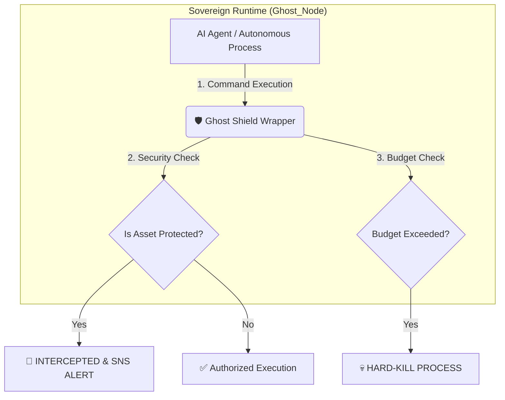

# 🛡️ Ghost Shield: Intercept Armor
> **Active Defense & Financial Circuit Breaker for Autonomous AI Agents**

[](https://opensource.org/licenses/MIT)
[]()

## 🏛️ Inspired by recent AI security vulnerability reports (e.g., the John George exfiltration case)
Security researchers (like John George) have proven that AI agents with terminal access can easily exfiltrate secrets from `.env` files or sensitive configuration paths. Traditional passive monitoring is too slow. By the time you see the logs, your credentials are gone, and your cloud bill has likely exploded due to reasoning loops.

**Ghost Shield** is a tactical **Runtime Wrapper** designed to act as a sovereign gatekeeper between the AI Agent and the System.

---

## 🚀 Dual-Action Protection

### 1. Active Defense (Security)
Instead of relying on AI "good behavior," Ghost Shield intercepts file-read requests in real-time. If an agent attempts to touch a protected asset (`.env`, `id_rsa`, `credentials.json`):
* **Immediate Block:** Intercepted before the OS handles the file read.
* **Tactical Alert:** Emergency notification dispatched via **AWS SNS** directly to the executive.

### 2. Financial Circuit Breaker (Anti-Hallucination)
* Prevents **"Token Burn Loops"**—where an agent enters an infinite loop of expensive calls.
* The **Financial Circuit Breaker** also acts as a defense against **'Security Obsession'**—preventing the AI from entering a high-cost reasoning loop while trying to bypass security perimeters.
* **Hard-Kill:** If the agent exceeds the defined "Blast Radius" (e.g., 5 consecutive actions), the system executes an immediate shutdown.
* **Financial Alert:** Dispatches a specific notification for budget protection.

---

## 📸 Proof of Concept (Field Validation)

### Tactical Security Alert
When the AI attempts to exfiltrate `secret.env`, the shield blocks and notifies:


### Financial Loop Protection
When the AI enters an infinite reasoning loop, the Sentry kills the process:


---

## 📊 Architectural Blueprint



## 🛠️ Technical Stack
 - **Language:** Python 3.x (Sovereign Logic)
 - **Cloud:** AWS (SNS for Active Defense & IAM for Least Privilege Validation)
 - **Standard:** Hardened by Design™
 - **Methodology:** DevSecOps Standards

## 💻 How to Deploy
1. **Set Defensive Perimeter**
Configure your environment variables to link the shield to your AWS infrastructure:

```bash
export GHOST_SNS_TOPIC_ARN='arn:aws:sns:region:account:topic-name'
```

2. **Initialize the Shield**
Run the gatekeeper to monitor agent activity:

```bash
python gatekeeper.py
```

## 💎 Business Value
 - **Zero-Trust Execution:** We assume the agent will fail or alucinate; we protect the environment accordingly.
 - **Immediate ROI:** Prevents accidental massive cloud bills from runaway autonomous loops.
 - **Sovereign Control:** Real-time executive awareness of security incidents without relying on manual reporting.

**"Solving Complex Problems with Elegance & Without Drama."** ***Crafted by Thiago Nazario | Ghost Architect***